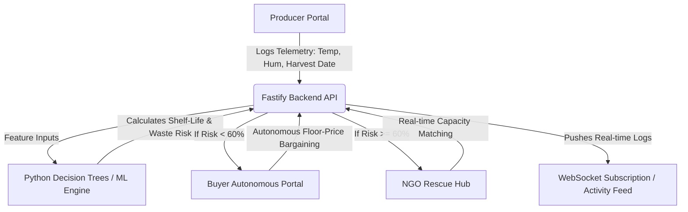

# 🌿 Sanjeevani — Freshness Intelligence Network

> **AI-Native Agricultural Preservation Gateway & Autonomous Zero-Waste Redirection Pipeline**

Sanjeevani is a cinematic, premium web application that solves the problem of post-harvest fresh produce waste. By combining real-time biochemical decay modeling, autonomous buyer-merchant bargaining, and automatic NGO emergency rescue dispatching, Sanjeevani ensures that every piece of produce reaches its highest-value utility before expiry.

---

## 📌 1. The Problem Statement

Globally, **over 35% of harvested fresh produce decays and is discarded** before ever reaching retail stores or end consumers. 
- **The Information Gap**: Farmers lack access to scientific, real-time predictions of biochemical degradation thresholds and shelf-life forecasts under varying telemetry inputs (humidity, temperature).
- **The Time Constraint**: Traditional agricultural marketplaces operate too slowly. When produce enters a high-risk decay window, there is no automatic system to dynamically adjust pricing floors or coordinate rapid-transit dispatches.
- **The Redistribution Waste**: Supply lines fail to bridge surplus produce with local food banks, charities, and community kitchens when commercial windows close.

---

## 💡 2. The Solution

Sanjeevani acts as an **eco-intelligent preservation routing system** that connects **Producers**, **Buyers**, and **NGO Rescuers** into a single autonomous loop:
- **Biochemical Predictors**: Interactive machine learning models predict decay risk indices based on crop type, harvest timestamps, temperature logs, and humidity targets.
- **Dynamic Commercial Floor Bargaining**: Near-expiry batches automatically trigger discounted floor pricing to attract buyer agents on short-notice routes.
- **Zero-Waste Redirection**: If a crop's decay velocity crosses critical safety thresholds (e.g. >60% risk), the platform auto-routes the remaining quantities to verified local community kitchens and NGO dispatch centers.

---

## 🏛️ 3. Architecture & Data Flow

Sanjeevani is structured as a modular multi-agent ecosystem composed of three layers:



### Portal Core:
1. **Producer Dashboard**: Allows farmers to seed batches, track moisture levels, and view visual decay charts.
2. **Buyer Agent Portal**: An autonomous broker interface matching discount buyers with near-expiry stocks.
3. **NGO Rescue Hub**: An emergency distribution gateway tracking rescue capacities and dispatch progress.

---

## 🛠️ 4. Technical Approach

- **Frontend**: Built on **React, TypeScript, and Vite**, using **Tailwind CSS** for a premium "naturecore" cinematic aesthetic (deep forest greens, earthy shadows, warm cream typography, and custom parallax keyframe animations). Uses **Recharts** for stock distributions and decay analytics.
- **Backend**: Built on **Node.js, TypeScript, and Fastify** with integrated **WebSockets** for real-time telemetry simulations and autonomous agent logs.
- **Machine Learning Engine**: Powered by **Python & Scikit-Learn**. It trains decision tree classifiers (`ml/train_models.py`) mapping environmental storage inputs to shelf-life boundaries, generating lightweight model trees exported directly to JSON for low-latency backend evaluations.

---

## ✨ 5. Key Features & USPs

- **Cinematic Parallax Hero**: A fully animated, layered agriculture sunrise background featuring wind-responsive swaying crop vectors, pollen particles, and mouse-parallax shifts.
- **Interactive Freshness Clock**: An SVG-stroked circular centerpiece that visualizes active crop shelf-life boundaries and decay velocity.
- **Simulation Decay Slider**: Allows users to drag a timeline slider to visually simulate produce degradation (using color saturation, sepia, and blur filters).
- **Interactive Live Rescue Grid Map**: A custom SVG coordination grid plotting active farms, retailers, and rescue dispatches with real-time data tracing tooltips and connecting flows.
- **Dynamic Crop Expansion**: Fully integrated database supporting Apple, Orange, Spinach, Cauliflower, Grapes, Guava, and Brinjal alongside classical produce types.

---

## 🚀 6. How to Run Locally

### Prerequisites
- [Node.js](https://nodejs.org/) (v18 or higher recommended)
- [Python 3.10+](https://www.python.org/) (for retraining ML models)

### Step 1: Clone and Set Up Dependencies
In the root directory, install the required packages:
```bash
# Install root, frontend, and backend packages
npm run install-all
```

### Step 2: Retrain the Machine Learning Models (Optional)
If you wish to refresh the prediction decision trees:
```bash
# Create python virtual environment
python -m venv .venv
.venv\Scripts\activate

# Install dependencies and train
pip install -r requirements.txt
python ml/train_models.py
```

### Step 3: Run the Development Servers
Launch both the Fastify backend and the Vite frontend simultaneously:
```bash
npm run dev
```
- **Frontend** will be running at: `http://localhost:5173`
- **Backend API** will be running at: `http://localhost:3000`

### Step 4: Verify Production Build
To test compilation for deployment:
```bash
npm run build
```
